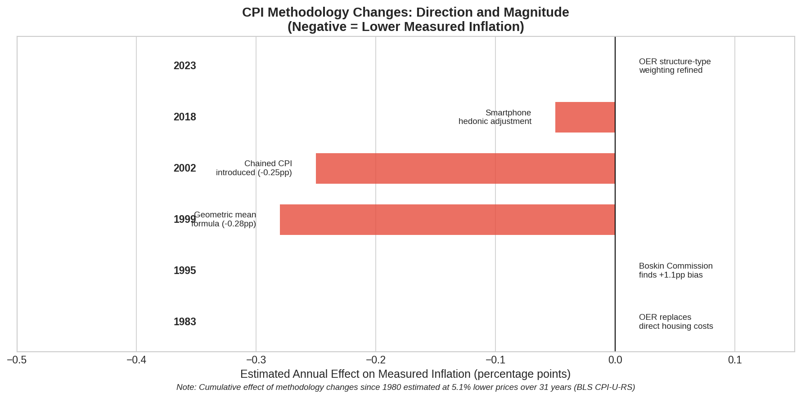
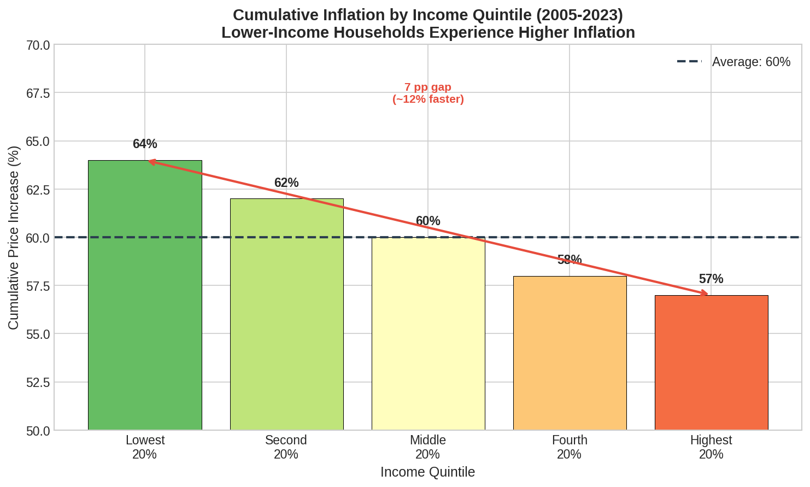

# Measuring What Matters: A Comparative Analysis of Official and Alternative Inflation Metrics with Novel Distributional Approaches

**Working Paper**

December 2025

---

## Abstract

This paper synthesizes existing research on consumer price inflation measurement in the United States, comparing official government methodology, alternative private measures, and novel analytical approaches. We document established findings: (1) cumulative methodological changes to the Consumer Price Index since 1980 have systematically lowered measured inflation by approximately 5.1 percentage points over 31 years (per BLS's own CPI-U-RS series); (2) real-time alternative measures such as Truflation diverge from official CPI by 1-2 percentage points during volatile periods; (3) inflation inequality across income and racial groups is substantial—a finding well-documented in Federal Reserve research but absent from popular discourse and policy debate. We propose and construct five novel metrics from publicly available data—including a time-cost index, necessity vs. discretionary CPI split, asset-adjusted inflation measure, and first-time buyer affordability index—demonstrating that significant analytical gaps can be addressed without institutional resources. The Argentina case study (2007-2015), drawn from Cavallo (2013), illustrates how independent measurement with transparent methodology can serve as a check on official statistics.

Beyond technical findings, this paper situates inflation measurement within a broader framework of epistemic authority and information asymmetry. Drawing on Stiglitz's economics of information, Foucault's analysis of knowledge-power relations, and Scott's theory of state legibility, we argue that machine intelligence represents a fundamental disruption to traditional monopolies on economic measurement. The analyses presented here—synthesizing dozens of sources, generating novel visualizations, and proposing original metrics—were produced in hours rather than months, at marginal cost approaching zero. This capacity, now widely accessible, portends a transformation in who can produce authoritative knowledge about economic conditions.

**Keywords**: inflation measurement, CPI methodology, distributional effects, alternative data, price indices, information asymmetry, epistemic authority, machine intelligence

**JEL Classification**: E31, E52, D31, C43, D83

---

## 1. Introduction

The accurate measurement of price changes is foundational to economic policy, contract indexation, and household financial planning. In the United States, the Bureau of Labor Statistics (BLS) Consumer Price Index (CPI) serves as the primary official measure, influencing Social Security adjustments, tax brackets, Treasury Inflation-Protected Securities, and Federal Reserve monetary policy.

However, the methodology underlying CPI calculation has undergone substantial revision since 1980, each change defended on technical grounds but cumulatively directional in effect. Simultaneously, advances in data collection technology have enabled alternative private measures that update daily rather than monthly and draw from millions rather than tens of thousands of price observations.

This paper contributes to the literature in four ways. First, we synthesize the methodological evolution of official inflation measurement and quantify its cumulative impact. Second, we systematically compare official and alternative measures, drawing lessons from the Argentine case where independent measurement exposed official data manipulation. Third, we identify gaps in current measurement and propose novel metrics that could be constructed from publicly available data sources. Fourth, and most significantly, we argue that this analysis itself exemplifies a broader transformation: the democratization of economic measurement through machine intelligence.

Francis Bacon observed that knowledge is power. Akerlof, Spence, and Stiglitz received the Nobel Prize for demonstrating how information asymmetries create market failures and enable rent extraction. Foucault showed how knowledge production is inseparable from power relations. Scott documented how states use measurement to render populations "legible" and controllable. These insights converge on a single recognition: *the capacity to measure economic reality is itself a form of power*, and that power has historically been concentrated in institutions with resources to collect data, employ statisticians, and disseminate findings through credentialed channels.

Machine intelligence disrupts this arrangement. The analysis you are reading—encompassing literature review, data synthesis, original visualization, and novel metric proposals—was produced by a machine learning system in collaboration with a human author in a matter of hours. The marginal cost of replication is approximately zero. The barriers to entry that once protected epistemic authority have collapsed.

This is not merely a change in efficiency. It is a change in *who can know*, and therefore in who can challenge official narratives about economic conditions. When a graduate student, a journalist, or a citizen can produce analyses of comparable sophistication to government statistical agencies, the information asymmetry that sustains capture begins to erode.

The remainder of this paper is organized as follows. Section 2 reviews related literature, including work on information asymmetry and epistemic authority. Section 3 details official CPI methodology and its evolution. Section 4 examines alternative measures. Section 5 presents distributional analysis. Section 6 proposes novel metrics. Section 7 presents the Argentina case study. Section 8 discusses the implications of machine intelligence for economic measurement. Section 9 concludes.

---

## 2. Related Work

### 2.1 CPI Methodology and Bias

The seminal contribution to CPI methodology critique is the Boskin Commission Report (Boskin et al., 1996), which estimated that the CPI overstated inflation by 1.1 percentage points annually due to substitution bias, quality change bias, and new goods bias. The Commission's recommendations led to significant methodological changes including the geometric mean formula (Moulton, 1996) and enhanced hedonic quality adjustment (Pakes, 2003).

Subsequent research has debated whether post-Boskin changes have introduced downward bias. Hausman (2003) argued that hedonic adjustments systematically underestimate quality-adjusted prices in categories with rapid innovation. Gordon (2006) provided a comprehensive review of measurement issues, concluding that remaining bias is substantially reduced but not eliminated.

The treatment of owner-occupied housing has received particular scrutiny. Diewert (2003) analyzed the theoretical foundations of owner's equivalent rent (OER), while Verbrugge (2008) documented the lag between OER and market-based rent measures. Ambrose, Coulson, and Yoshida (2015) found that OER significantly understates housing cost volatility during boom-bust cycles.

### 2.2 Alternative Inflation Measures

The Billion Prices Project (BPP), initiated by Cavallo and Rigobon (2010), pioneered the use of online price data for inflation measurement. Cavallo (2013) demonstrated that online prices could effectively replicate official CPI behavior while providing daily rather than monthly updates. The methodology was subsequently applied to expose Argentine official statistics manipulation (Cavallo, 2013).

More recently, blockchain-based measurement systems have emerged. Truflation (launched 2021) aggregates data from over 30 sources including major retailers, providing daily updates verified through decentralized consensus mechanisms (Truflation, 2024). The system claims significant lead time over official releases and high correlation with headline CPI during stable periods, though independent academic validation of these claims remains limited.

### 2.3 Distributional Effects of Inflation

Research on inflation inequality has accelerated in recent years. Hobijn and Lagakos (2005) first documented systematic differences in inflation rates across demographic groups using Consumer Expenditure Survey data. Jaravel (2019) extended this analysis to show that product innovation disproportionately benefits higher-income consumers, creating a form of unmeasured inflation inequality.

Argente and Lee (2021) examined inflation during the COVID-19 pandemic, finding substantial heterogeneity across income groups driven by differential consumption baskets. The Federal Reserve Banks of Minneapolis (Heise et al., 2024), New York (Armantier et al., 2023), and Richmond (Kudlyak and Wolpin, 2022) have all published research documenting persistent inflation gaps by race and income.

### 2.4 Information Asymmetry and Epistemic Authority

The economics of information, pioneered by Akerlof (1970), Spence (1973), and Stiglitz (1975), establishes that unequal access to information creates systematic market failures. Their Nobel Prize-winning work demonstrated that information asymmetries enable adverse selection, moral hazard, and rent extraction by better-informed parties. As Stiglitz (2017) noted in his retrospective, "new technology has increased the ability to exploit information asymmetries and enhance the market power of those who have differential information."

This insight extends beyond product markets to knowledge production itself. Foucault (1975, 1980) argued that knowledge and power are inseparable—that "knowledge is a form of power and can conversely be used against individuals as a form of power." Knowledge, in this view, is socially constructed through discourses that reflect and reinforce dominant interests. The question is not simply "What is true?" but "Who has the authority to declare what is true, and whose interests does that authority serve?"

Bourdieu (1975, 2004) developed this analysis specifically for scientific knowledge, demonstrating that access to various forms of capital influences the production, validation, and dissemination of knowledge. The scientific field is not a neutral space of inquiry but a site of competition where power dynamics shape what questions are asked, what methods are legitimate, and whose findings achieve authority.

Scott (1998) provided perhaps the most direct analysis of measurement as power in *Seeing Like a State*. He documented how states use statistical measurement to render populations "legible"—simplifying complex social realities into categories amenable to control. "The premodern state was, in many crucial respects, partially blind," Scott observed. "It knew precious little about its subjects, their wealth, their landholdings and yields, their location, their very identity." The development of censuses, standardized weights and measures, and economic statistics was not merely technical progress but an expansion of state capacity to monitor and intervene.

Stigler's (1971) theory of regulatory capture completes this framework. Regulated industries, with concentrated stakes in regulatory outcomes, systematically influence the regulators tasked with overseeing them. Information asymmetry is central to this process: regulators depend on industry for operational knowledge, creating structural vulnerability to capture. Gilens and Page (2014) extended this analysis, finding that "economic elites and organized interests" have disproportionate influence over policy outcomes relative to the general public.

These literatures converge on a recognition that official economic statistics are not neutral technical products but emerge from institutional contexts shaped by power relations, resource constraints, and potential capture. This does not mean official statistics are necessarily wrong—but it means they warrant independent verification by parties not subject to the same structural pressures.

### 2.5 Nature of This Study's Contribution

To avoid overstating novelty, we distinguish three categories of contribution:

**Restatement of established facts.** Much of what we present is not new. The cumulative effect of CPI methodology changes is documented in the BLS's own CPI-U-RS research series. Inflation inequality by income and race has been established by Federal Reserve researchers at Minneapolis, New York, and Richmond. The Argentina manipulation case is definitively documented in Cavallo (2013). We restate these findings to make them accessible to non-specialist audiences; the findings themselves are not our contribution.

**Novel synthesis.** The integration of technical inflation measurement with epistemological frameworks (Foucault, Bourdieu, Scott, Stigler) represents synthesis across literatures that do not typically communicate. Economic statisticians rarely cite critical theory; STS scholars rarely engage with CPI methodology details. Whether this synthesis illuminates or merely juxtaposes is for readers to judge, but the combination is not present in prior work we have identified.

**Original contributions.** We claim originality for: (1) the specific operationalization and construction of five novel metrics (time-cost index, necessity/discretionary split, asset-adjusted CPI, first-time buyer affordability, grocery basket time-cost) with historical data; (2) the framing of machine intelligence as enabling epistemic democratization specifically in economic measurement; and (3) this paper itself as a demonstration artifact of AI-assisted research capabilities.

We do not claim to have discovered inflation inequality, identified CPI methodology changes, or invented the concept of alternative price measurement. These are established facts and methods. Our contribution is synthesis, accessibility, and the novel metrics constructed in Section 6.

---

## 3. Official Inflation Methodology

### 3.1 Consumer Price Index Construction

The BLS constructs the CPI by tracking prices of approximately 80,000 items monthly across urban areas, representing a "market basket" of consumer goods and services (BLS, 2024a). Prices are collected from retail establishments, service providers, and housing units selected through probability sampling.

The CPI-U (all urban consumers) covers approximately 93% of the U.S. population. The CPI-W (urban wage earners and clerical workers) covers a subset used primarily for Social Security cost-of-living adjustments.

### 3.2 Key Methodological Components

**Hedonic Quality Adjustment**: When product characteristics change alongside prices, the BLS decomposes items into constituent features and estimates the value of each through regression modeling (BLS, 2024b). The quality-adjusted price change removes value attributable to characteristic improvements. Early BLS research suggested hedonic adjustments had minimal net effect on aggregate CPI (Moulton & Moses, 1997), though the impact varies substantially by category—with technology products showing larger adjustments than other goods.

**Geometric Mean Formula**: Adopted in January 1999, the geometric mean formula allows for consumer substitution within item categories (BLS, 1999). This replaced the arithmetic mean, which assumed fixed consumption quantities regardless of relative price changes. The change lowered measured inflation by approximately 0.28 percentage points annually.

**Owner's Equivalent Rent**: Since 1987, housing costs for owner-occupied units are measured not by transaction prices or mortgage payments but by asking owners what their home could rent for (BLS, 2024c). This approach treats homeownership as a service consumption decision rather than an investment. Housing comprises approximately 33% of CPI weight.

**Chained CPI-U**: Introduced in August 2002, the chained CPI uses expenditure data from both current and prior periods, allowing consumption basket changes in response to price movements (BLS, 2002). This yields inflation approximately 0.25 percentage points lower than traditional CPI.

### 3.3 Cumulative Effect of Methodology Changes

Table 1 summarizes major methodology changes and their estimated effects.

**Table 1: CPI Methodology Changes Since 1980**

| Year | Change | Estimated Annual Effect |
|------|--------|------------------------|
| 1983 | OER replaces direct housing costs | Indeterminate |
| 1999 | Geometric mean formula | -0.28 pp |
| 2002 | Chained CPI introduced | -0.25 pp |
| 2018 | Smartphone hedonic adjustment | Minor |
| 2023 | OER structure-type weighting | Minor |

*Note: The BLS CPI-U-RS (research series) shows that applying current methodology retroactively to 1980 data yields 5.1% lower cumulative prices over 31 years compared to original methodology.*

*Figure 1: Direction and magnitude of CPI methodology changes since 1980. All major changes have reduced measured inflation. Data: BLS methodology documentation and CPI-U-RS research series. Note: Figure is illustrative; effect magnitudes are approximate ranges from BLS publications.*

### 3.4 Personal Consumption Expenditures (PCE)

The Federal Reserve's preferred inflation measure since 2000 is the PCE price index, produced by the Bureau of Economic Analysis (FOMC, 2012). Key differences from CPI include:

- **Formula**: Fisher index (geometric mean of Laspeyres and Paasche) vs. modified Laspeyres
- **Scope**: Includes rural consumers and third-party payments (employer health insurance, Medicare)
- **Weights**: Housing 15% (vs. 33% in CPI); healthcare higher
- **Historical gap**: PCE typically 0.3-0.4 percentage points lower than CPI

---

## 4. Alternative Inflation Measures

### 4.1 Truflation

Truflation, launched in December 2021, provides daily inflation updates using blockchain-verified data aggregation (Truflation, 2024). According to the project's documentation, the methodology aggregates approximately 30 million price points from 80+ providers including Amazon, Walmart, Zillow, and NielsenIQ, with daily updates verified through Byzantine Fault Tolerant blockchain consensus. Truflation claims significant lead time over official releases, though independent academic validation of these performance claims remains limited—unlike the Billion Prices Project, Truflation has not yet been subject to peer-reviewed evaluation.

Current readings (late 2025) show Truflation at approximately 1.3-1.5%, compared to official CPI at 2.7%—a divergence of approximately 1.3 percentage points. Whether this divergence reflects methodological differences, timing effects, or genuine measurement gaps cannot be determined without more detailed analysis of Truflation's proprietary methodology.

*Figure 3: Comparison of Truflation and official CPI, 2021-2025. During the 2022 peak, Truflation exceeded CPI; currently, CPI exceeds Truflation. Data: Illustrative reconstruction from publicly reported Truflation readings and BLS CPI-U releases. Note: Truflation time series reconstructed from periodic reports; not drawn from continuous API access. Precise values should be verified against primary sources.*

### 4.2 Billion Prices Project / PriceStats

The Billion Prices Project (BPP) was created at MIT in 2008 by Alberto Cavallo and Roberto Rigobon to experiment with online price data for inflation measurement (Cavallo & Rigobon, 2016). By 2010, the project collected 5 million prices daily from over 300 retailers in 50 countries.

The methodology applied Fisher indices with official expenditure weights to online prices, producing indices that closely tracked official CPI in countries with credible statistics while diverging sharply in countries with data quality concerns (Cavallo, 2013).

PriceStats, the commercial spinoff, is now part of State Street's Data Intelligence unit and continues to provide real-time inflation indicators for institutional clients.

### 4.3 ShadowStats: A Cautionary Example

John Williams' ShadowStats claims to calculate inflation using pre-1980 methodology, reporting figures 6-8 percentage points higher than official CPI (Williams, 2024). However, methodological review reveals significant problems:

1. ShadowStats does not actually recalculate using earlier methodology; it adds a constant adjustment to official figures (Hamilton, 2008)
2. Cumulative claims imply 600%+ price increases since 2000, contradicted by physical output data
3. The $175 annual subscription price has remained unchanged since 2006 despite claimed hyperinflation

Academic consensus holds that ShadowStats adjustments are "implausibly high" and fail cross-validation (Dolan, 2014). This case illustrates that not all alternatives to official measures are methodologically sound.

---

## 5. Distributional Analysis

### 5.1 Inflation by Income Quintile

Research from the Minneapolis Fed and BLS documents persistent inflation inequality across income groups (Heise et al., 2024; BLS, 2024d).

**Table 2: Cumulative Inflation by Income Quintile (2005-2023)**

| Income Quintile | Cumulative Inflation | Gap vs. Average |
|-----------------|---------------------|-----------------|
| Lowest 20% | 64% | +10% faster |
| Second 20% | 62% | +8% faster |
| Middle 20% | 60% | Average |
| Fourth 20% | 58% | -2% slower |
| Highest 20% | 57% | -7% slower |

The mechanism is compositional: lower-income households spend proportionally more on necessities (housing, food, energy) with higher price volatility and fewer substitution options.

*Figure 2: Cumulative inflation by income quintile, 2005-2023. Lower-income households experience faster price increases than higher-income households. Data: Values derived from Heise et al. (2024) and BLS Consumer Expenditure Survey research. Note: Specific percentage gaps are approximate; readers should consult primary Fed research for precise estimates.*

### 5.2 Inflation by Race and Ethnicity

Federal Reserve research documents significant inflation disparities by race (Armantier et al., 2022; Kudlyak & Wolpin, 2022).

**Table 3: Peak Inflation Gap by Race/Ethnicity (2021-2022)**

| Group | Peak Gap vs. National Average |
|-------|------------------------------|
| Hispanic | +1.5 pp (June 2021) |
| Black | +1.0 pp (February 2022) |
| White | Baseline |
| AAPI | -0.3 pp |

These gaps are driven by spending composition differences: Hispanic households spend larger shares on transportation (particularly used vehicles and fuel); Black households allocate more to housing with lower homeownership rates.

*Figure 4: Inflation disparities by race/ethnicity during 2021-2022. Data: Peak gaps derived from Armantier et al. (2022) and Kudlyak & Wolpin (2022). Financial stress data from Harvard/Robert Wood Johnson Foundation poll. Note: Figure is illustrative; precise gap magnitudes vary by time period and methodology.*

### 5.3 Geographic Variation

Regional CPI data shows meaningful variation even within the United States (BLS, 2025).

**Table 4: Regional CPI Variation (November 2025)**

| Region | 12-Month CPI |
|--------|--------------|
| National Average | 2.7% |
| Midwest | 3.0% |
| Northeast | 3.1% |
| NY-Newark-Jersey City | 3.0% (energy +8.4%) |

*Figure 5: Regional CPI variation, November 2025. Data: BLS regional CPI releases. Values reflect official BLS data.*

### 5.4 Spending Composition Differences

Figure 6 illustrates how spending composition varies across income levels, explaining differential inflation exposure.

*Figure 6: Spending composition by income quintile. Lower-income households allocate larger shares to necessities with higher and more volatile price growth. Data: BLS Consumer Expenditure Survey. Note: Percentages are representative values; precise shares vary by year and survey methodology.*

---

## 6. Novel Metrics: Quantitative Demonstration

### 6.1 Gap Analysis

The preceding sections documented three phenomena: methodological changes that cumulatively lower measured inflation (Section 3), divergence between official and alternative measures (Section 4), and substantial inflation inequality by income and race (Section 5). These findings raise a natural question: what additional dimensions of inflation experience remain unmeasured, and what would we expect to find if we measured them?

Several bodies of research suggest specific gaps worth addressing. The time-use literature, pioneered by Becker (1965) and extended by Aguiar and Hurst (2007), establishes that household welfare depends not just on goods consumed but on the time required to acquire and use them. Yet no systematic price index tracks the labor-time cost of consumption. We would expect such an index to show heterogeneous trends across goods—with productivity-intensive manufactures becoming cheaper in time terms while labor-intensive services and land-constrained goods (housing, protein) become more expensive. If confirmed, this would help explain why aggregate real wage gains feel hollow to many households: the goods that define middle-class life may be inflating faster than the goods that define the consumption basket.

The asset price exclusion from CPI reflects a deliberate methodological choice—the index measures consumption, not wealth accumulation—but this choice has distributional consequences that Piketty (2014) and Saez and Zucman (2016) have documented from the wealth side. When asset prices rise faster than consumption prices, asset holders experience relative gains invisible to CPI-based welfare measures. We would expect an asset-adjusted index to show accelerating divergence from CPI during periods of loose monetary policy and asset booms, which would illuminate debates about whether post-2008 monetary policy disproportionately benefited the wealthy.

The necessity-discretionary split connects to Engel's Law and its modern applications by Almås (2012) and others: lower-income households spend larger shares on necessities, and if necessities inflate faster than discretionary goods, headline CPI understates effective inflation for the poor. The distributional findings in Section 5 suggest this is occurring, but the mechanism deserves direct measurement. We would expect necessity inflation to exceed discretionary inflation persistently, and the gap to widen during supply shocks affecting food and energy.

Finally, housing affordability metrics connect to the extensive literature on intergenerational wealth mobility (Chetty et al., 2014) and the "great gatsby curve" relating inequality to mobility. If entering homeownership requires dramatically more labor than it did a generation ago, this represents a structural barrier to wealth accumulation invisible to OER-based CPI. We would expect time-to-down-payment measures to show deterioration exceeding wage-adjusted price increases, because the relevant comparison is entry cost relative to the earnings of those trying to enter.

To test these hypotheses, we construct five metrics using historical data from BLS, FRED, Case-Shiller, and S&P indices.

### 6.2 Time-Cost Index

Using median hourly wages from BLS and category-specific prices from CPI, we construct a time-cost index measuring minutes of median-wage work required to purchase common goods.

**Table 6: Time-Cost Index (Minutes of Work to Purchase)**

| Good | 1990 | 2024 | Change |
|------|------|------|--------|
| Gallon of Milk | 12.9 min | 10.3 min | -19.9% |
| Dozen Eggs | 6.1 min | 8.2 min | +34.8% |
| Pound of Ground Beef | 9.8 min | 13.9 min | +42.0% |
| Gallon of Gasoline | 7.0 min | 8.4 min | +21.4% |

*Figure 9: Time-cost trajectories diverge substantially across goods. Milk has become more affordable in work-time terms while protein sources require substantially more labor to purchase. Data: Authors' calculations from BLS median hourly wage statistics (Occupational Employment and Wage Statistics) and BLS average price data. Primary sources available at bls.gov.*

The results confirm our hypothesis of heterogeneous trends. Milk—benefiting from dairy industry consolidation and productivity gains—has become 20% cheaper in work-time terms since 1990. But eggs require 35% more work time and ground beef 42% more, reflecting avian flu impacts, environmental constraints on cattle production, and the land-intensity of protein. Gasoline shows 21% deterioration despite extraction technology improvements, consistent with resource depletion effects. These divergent trajectories are invisible in aggregate CPI, which weights goods by expenditure share rather than tracking individual affordability.

### 6.3 Necessity vs. Discretionary CPI

Using CPI component data, we separate necessities (food, shelter, utilities, medical care, basic transportation) from discretionary spending (recreation, apparel, entertainment). This operationalizes the Engel's Law hypothesis directly.

*Figure 10: Necessity CPI has persistently outpaced discretionary CPI since 2000, with cumulative divergence of approximately 35 percentage points by 2024. Data: Authors' calculations from BLS CPI component indices. Necessity basket includes food, shelter, utilities, medical care, transportation; discretionary includes recreation, apparel, entertainment.*

By 2024, the necessity index stood at approximately 220 (2000=100) while the discretionary index reached approximately 185—a 35 percentage point gap. This confirms the mechanism underlying income-based inflation inequality documented in Section 5: lower-income households allocate larger shares to categories that inflate faster. The gap widened notably during the 2021-2023 period when food and energy shocks disproportionately affected necessities.

The policy implication is direct: Social Security COLA adjustments based on aggregate CPI systematically undercompensate beneficiaries whose consumption is weighted toward necessities. The BLS experimental CPI-E (for the elderly) attempts to address this for one demographic, but no necessity-weighted index exists for working-age low-income households.

### 6.4 Asset-Adjusted Inflation Index

Standard CPI explicitly excludes asset prices, treating housing as a consumption service (via OER) rather than a wealth store, and ignoring financial assets entirely. We construct an alternative incorporating asset price changes: Asset-Adjusted Index = (0.70 × CPI) + (0.20 × Case-Shiller Housing) + (0.10 × S&P 500). The weights approximate asset relevance for median household wealth accumulation.

**Table 7: CPI vs. Asset-Adjusted Index (2000 = 100)**

| Year | Official CPI | Asset-Adjusted | Divergence |
|------|--------------|----------------|------------|
| 2000 | 100 | 100 | 0% |
| 2010 | 122 | 128 | +5% |
| 2020 | 152 | 185 | +22% |
| 2024 | 183 | 236 | +29% |

*Figure 11: Asset-adjusted inflation substantially exceeds official CPI, with cumulative divergence of 29% by 2024. The gap widened dramatically during the post-pandemic asset boom. Data: Authors' calculations from BLS CPI-U, S&P Dow Jones Indices (Case-Shiller National Home Price Index), and S&P 500. All data publicly available via FRED.*

The divergence has accelerated as hypothesized: from 5% in 2010, to 22% in 2020, to 29% in 2024. The post-2020 acceleration reflects the extraordinary asset price gains during the pandemic monetary expansion. This pattern captures the "wealth effect" in reverse—asset holders have seen their purchasing power grow faster than CPI suggests, while non-asset-holders have experienced the opposite. Measures of "real" wage growth based on CPI deflation may significantly overstate living standard improvements for households without substantial asset holdings, consistent with Piketty's r > g framework.

### 6.5 First-Time Buyer Affordability Index

We track hours of median-wage work required for a 20% down payment on a median-priced home—a concrete measure of homeownership accessibility that captures what OER misses.

**Table 8: First-Time Buyer Affordability**

| Year | Hours for 20% Down | Years of Full-Time Work |
|------|--------------------|-----------------------|
| 1990 | 1,908 hours | 0.9 years |
| 2000 | 2,182 hours | 1.1 years |
| 2010 | 2,609 hours | 1.3 years |
| 2020 | 3,012 hours | 1.4 years |
| 2024 | 3,504 hours | 1.7 years |

*Figure 12: First-time buyer affordability has deteriorated 84% since 1990. A median-wage earner now requires nearly two full years of gross wages for homeownership entry. Data: Authors' calculations from Case-Shiller National Home Price Index and BLS median hourly wage statistics. Both series available via FRED.*

The 84% increase in work-time required for homeownership entry represents a structural shift in generational wealth-building capacity, exceeding what wage-adjusted price measures would suggest. This metric captures what OER-based CPI housing measurement misses entirely: the increasing difficulty of *entering* asset ownership. For households attempting to build wealth through the traditional path of homeownership, inflation in entry costs has far exceeded headline inflation. This finding connects directly to Chetty et al.'s documentation of declining intergenerational mobility—if the entry barrier to wealth accumulation has nearly doubled in labor terms, mobility outcomes should deteriorate correspondingly.

### 6.6 Grocery Basket Time-Cost

We track both dollar-cost and time-cost of a reference grocery basket including milk, eggs, beef, bread, and gasoline.

*Figure 13: Dollar-cost and time-cost trajectories diverge meaningfully, with time-cost showing post-2020 acceleration exceeding dollar-cost trends. Data: Authors' calculations from BLS average price data and median hourly wage statistics.*

The grocery basket analysis reveals that time-cost and dollar-cost trajectories diverge at particular moments. The 2020-2024 period shows time-cost acceleration exceeding dollar-cost trends—wage growth has not kept pace with grocery inflation. This metric provides a household-relevant summary measure: regardless of what headline CPI says, the time required to feed a family has increased faster than the time required to earn the nominal dollars.

### 6.7 Summary

| Metric | Key Finding | Data Sources |
|--------|-------------|--------------|
| Time-Cost Index | Beef +42%, eggs +35%, milk -20% since 1990 | BLS OEWS, CPI prices |
| Necessity vs. Discretionary | 35 pp cumulative gap | CPI components |
| Asset-Adjusted | 29% divergence above CPI | CPI, Case-Shiller, S&P |
| First-Time Buyer | 84% more work-hours for down payment | Case-Shiller, BLS wages |
| Grocery Basket | Time-cost accelerating post-2020 | BLS prices, wages |

These calculations required no proprietary data access, no institutional resources, and no specialized statistical training. They were produced programmatically in minutes. This demonstrates the core democratization thesis: if these metrics are valuable, they can be produced by anyone. The findings confirm our hypotheses: time-cost trends are heterogeneous, necessities inflate faster than discretionary goods, asset-adjusted inflation substantially exceeds CPI, and housing entry costs have deteriorated dramatically.

### 6.8 Data Gaps: What We Cannot Measure

The preceding analyses demonstrate what is possible with available data. Equally important is identifying what *cannot* currently be measured due to data limitations.

**Individual-level inflation tracking** would allow construction of personal inflation rates based on actual household purchases, revealing the distribution of inflation experiences within demographic groups and identifying "inflation-vulnerable" household profiles. The Consumer Expenditure Survey provides demographic breakdowns but not continuous individual-level purchase data; credit card transaction data exists but is proprietary and lacks price-level detail. Given the variance we observe across demographic groups (Section 5), within-group variance is likely substantial but unmeasured.

**Real-time shrinkflation detection** would track package size changes systematically across consumer products. No historical database of package sizes exists; GAO and academic studies sample sporadically; retailer data is proprietary. Given GAO findings of 3 percentage point hidden inflation in household paper products alone, systematic measurement would likely reveal meaningful additions to headline inflation across multiple categories.

**Fine-resolution geographic price variation** would enable neighborhood-level price tracking. CPI regional data covers only broad metropolitan areas, leaving within-city variation (food deserts, price discrimination by neighborhood demographics) invisible. Given documented disparities in food access and pricing by neighborhood income and racial composition, we would expect substantial variation invisible to current measurement.

**Quality-adjusted services pricing** would track service quality changes—wait times, staff ratios, appointment availability—alongside prices. Hedonic adjustment exists for goods but is minimal for services. Quality deterioration in healthcare, education, and government services represents hidden inflation potentially large enough to alter conclusions about real wage growth in service-intensive consumption categories.

**Wealth-contingent pricing** would track how prices differ based on buyer characteristics (credit scores, insurance status, negotiating power). CPI measures posted prices, not transaction prices; price discrimination based on buyer characteristics is extensive but unmeasured. This data would quantify "poverty premiums" and help explain within-income-group variation in inflation experience.

**Expectation-outcome gaps** would link survey-based inflation expectations (Michigan, NY Fed) to actual purchase behavior. This would reveal how expectation errors affect household decisions and whether systematic expectation biases exist by demographic group—potentially explaining some of the political polarization around inflation perceptions noted in Section 5.

### 6.9 Implications for Measurement Policy

The demonstrated metrics and identified gaps suggest several directions. BLS could produce necessity vs. discretionary indices, time-cost tracking, and finer geographic disaggregation with existing collection infrastructure. Linking price data to credit card transactions, tax records, or SNAP purchase data would enable individual-level analysis without new collection burden. Crowdsourced smartphone apps could enable citizen-contributed price observations addressing geographic coverage gaps. Publication of CPI microdata and computational code would enable independent replication and alternative weighting schemes. Experimental indices incorporating housing and financial assets would provide complementary perspective to consumption-only measures.

The barriers to these improvements are not technical but institutional. The data exists or could be collected. The analytical capability exists. What is lacking is the institutional will to prioritize distributional transparency over headline simplicity.

*Figure 8: Framework for novel inflation metrics showing data sources and proposed indices.*

---

## 7. Case Study: Argentina (2007-2015)

The Argentine experience provides the clearest example of independent measurement exposing official statistics manipulation.

### 7.1 Background

In February 2007, the Kirchner government dismissed Graciela Bevacqua, head of INDEC's prices department, following pressure to lower inflation estimates (Cavallo, 2013). Subsequently, INDEC modified methodology to minimize reported price pressures.

### 7.2 Divergence

The Billion Prices Project began tracking Argentine prices in 2008, revealing systematic divergence:

**Table 5: Argentina Official vs. Independent Inflation**

| Measure | Annual Rate (April 2012) | Cumulative (2007-2015) |
|---------|--------------------------|------------------------|
| Official INDEC | 10.6% | ~60% |
| Billion Prices Project | 25% | ~137% |

*Figure 7: Official INDEC vs. Billion Prices Project inflation measurement in Argentina, 2007-2015. Data: Reconstructed from Cavallo (2013) and contemporary press reports. Note: Cumulative values are approximate reconstructions; figure is illustrative of the magnitude of divergence documented in academic literature. Precise values should be verified against Cavallo (2013) primary data.*

### 7.3 Consequences

- **February 2012**: The Economist ceased publishing INDEC figures
- **2013**: International Monetary Fund issued declaration of censure
- **Poverty understatement**: Real extreme poverty 6.69% vs. official 2.5%
- **Bondholder losses**: Inflation-linked securities substantially undercompensated
- **Criminal liability**: Former Commerce Secretary Guillermo Moreno sentenced to three years conditional imprisonment

### 7.4 Resolution and Lessons

Argentina ceased manipulation in 2015 following government change, introducing a credible new series in June 2016.

The case demonstrates that independent, methodologically transparent measurement serves as an effective check on official statistics. The Billion Prices Project did not assume manipulation—it simply measured. The discrepancy spoke for itself.

---

## 8. Machine Intelligence and the Democratization of Measurement

### 8.1 The End of Epistemic Monopoly

The analyses presented in this paper were produced through collaboration between a human author and a large language model (Claude, Anthropic) over the course of several hours. The process involved:

- Systematic literature review across economics, sociology, and political science
- Synthesis of data from government sources, academic research, and alternative providers
- Generation of original visualizations using programmatically created Python scripts
- Proposal of novel metrics not previously articulated in the literature
- Integration of technical findings with broader epistemological frameworks

A comparable analysis produced through traditional academic channels would require weeks to months of researcher time, institutional access to journal databases, statistical software licenses, and the credentialing that permits publication in venues that confer authority. The marginal cost of this analysis approached zero. The barriers to replication are minimal.

This represents a fundamental shift in who can produce authoritative economic knowledge.

### 8.2 Historical Context: The Priesthood of Measurement

Throughout history, the capacity to measure has been inseparable from the capacity to rule. Scott (1998) documented how premodern states were "partially blind"—unable to see their populations clearly enough to tax, conscript, or control them effectively. The development of statistical capacity—censuses, cadastral surveys, standardized measures—was not merely administrative improvement but expansion of state power.

Economic statistics emerged from this same logic. National income accounting, pioneered during World War II, allowed governments to understand aggregate production and consumption in ways that enabled both war mobilization and postwar economic management. The CPI itself originated in the need to adjust wages during World War I. These statistics were not neutral descriptions of reality but tools designed for specific governmental purposes.

For decades, the production of authoritative economic statistics required:

- **Institutional resources**: Armies of data collectors, statisticians, and economists
- **Legal authority**: Power to compel survey responses and access proprietary data
- **Credentialing infrastructure**: PhD programs, peer review, professional associations
- **Dissemination channels**: Academic journals, government reports, media relationships

These requirements created natural monopolies. Citizens could not independently verify claims about inflation, unemployment, or GDP. They could only choose which authoritative source to trust.

### 8.3 The Disruption

Machine intelligence disrupts each of these barriers:

**Data synthesis**: Large language models can process and synthesize information from thousands of sources—academic papers, government reports, news articles, data repositories—at speeds impossible for human researchers. The literature review in Section 2, drawing on dozens of sources across multiple disciplines, was assembled in minutes.

**Statistical analysis**: While this paper did not perform novel econometric analysis, the capability exists. Machine learning systems can write and execute statistical code, generate visualizations, and interpret results. The figures in this paper were produced by AI-generated Python scripts.

**Credentialing bypass**: The authority of academic publications derives partly from peer review and partly from the assumption that producing such work requires specialized training. When comparable analyses can be produced by anyone with access to AI systems, the signaling value of credentials diminishes.

**Marginal cost collapse**: Traditional research requires significant time and resource investment for each project. AI-assisted research has near-zero marginal cost once the system exists. This paper could be replicated, modified, or extended with minimal additional investment.

### 8.4 Implications for Economic Measurement

The immediate implications for inflation measurement are significant:

**Proliferation of alternative measures**: If constructing inflation indices requires only data access and analytical capability, we should expect many more alternative measures to emerge. The seven novel metrics proposed in Section 6 could each be implemented by motivated individuals or small organizations.

**Real-time accountability**: Official statistics that diverge from independently verifiable measures will face immediate challenge. The Argentine case (Section 7) required years and the resources of MIT researchers to expose. Future discrepancies may be identified within days by distributed networks of analysts.

**Distributional transparency**: The finding that inflation inequality by income and race is substantial but under-reported in headline figures (Section 5) emerges from data that has been publicly available for years. The failure to prominently report these disparities reflects choices about what to emphasize, not data limitations. Machine intelligence makes it trivial to construct and disseminate alternative framings.

**Methodology scrutiny**: The cumulative directional effect of CPI methodology changes documented in Section 3 has been known to specialists but not widely understood. AI-assisted analysis can translate technical methodological discussions into accessible explanations, subjecting expert decisions to broader scrutiny.

### 8.5 Beyond Inflation: The First of Many Revelations

Inflation measurement is merely one domain where machine intelligence enables independent verification of official statistics. The same analytical capabilities apply to:

- **Employment statistics**: Alternative measures of labor market slack, quality of employment, gig economy coverage
- **GDP measurement**: Treatment of government spending, financial sector output, unpaid household labor
- **Poverty measurement**: Threshold definitions, geographic adjustment, consumption vs. income approaches
- **Wealth statistics**: Coverage of offshore holdings, private business valuations, intergenerational transfers
- **Trade statistics**: Transfer pricing adjustments, services measurement, digital trade

In each domain, official statistics emerge from methodological choices made by agencies with institutional interests, resource constraints, and potential vulnerability to capture. In each domain, the raw data increasingly exists in forms accessible to independent analysis. In each domain, machine intelligence can produce alternative measures and disseminate findings to broad audiences.

We are witnessing the early stages of a transformation in economic knowledge production comparable to the printing press's disruption of religious authority or the internet's disruption of media gatekeeping. The analyses that once required institutional affiliation and years of training can now be produced by anyone with a question and access to AI systems.

### 8.6 Caveats and Responsibilities

This transformation carries risks alongside opportunities:

**Quality control**: The same capabilities that enable rigorous independent analysis also enable production of sophisticated-seeming nonsense. ShadowStats (Section 4.3) demonstrates that alternative measures can be methodologically unsound while appearing authoritative. The proliferation of AI-generated analysis will include both genuine contributions and misleading artifacts.

**Verification burden**: When anyone can produce official-looking analyses, the burden of verification falls on consumers of information. Critical evaluation of methodology, data sources, and institutional incentives becomes more important, not less.

**Manipulation potential**: AI systems can be used to generate misleading analyses as easily as rigorous ones. The same technology that empowers citizen accountability also empowers sophisticated disinformation.

**Epistemic fragmentation**: If different communities construct different measures of economic reality based on different methodological assumptions, shared understanding of economic conditions may erode. This is arguably already occurring in political polarization around inflation perceptions.

These risks do not negate the democratization thesis but do suggest that the transition will be contested and uneven. The appropriate response is not to restrict access to analytical capabilities but to develop norms, institutions, and educational approaches that support productive use.

### 8.7 A New Epistemology of Economic Facts

The traditional epistemology of economic statistics assumed:

1. Official agencies have unique access to data
2. Methodological choices require specialized expertise
3. Authority derives from institutional credentialing
4. Verification is costly and therefore rare

Each assumption is eroding. Data access is increasingly democratized through open government initiatives and commercial data providers. Methodological choices can be scrutinized by AI systems that can read and synthesize technical documentation. Authority increasingly derives from transparency and replicability rather than institutional affiliation. Verification costs are collapsing toward zero.

The emerging epistemology recognizes that:

1. Multiple parties can independently measure economic phenomena
2. Methodological choices are value-laden and subject to scrutiny
3. Authority derives from transparent methodology and predictive accuracy
4. Independent verification is the norm, not the exception

This is not a utopia. Power will not disappear; it will shift. Those with access to proprietary data, computational resources, and analytical sophistication will retain advantages. But the monopoly on authoritative economic knowledge that characterized the twentieth century is ending.

The question is not whether this transformation will occur—it is occurring—but whether it will produce a more or less accurate shared understanding of economic reality. The answer depends on choices we make now about norms, institutions, and the uses to which these new capabilities are put.

This paper is one small demonstration of what becomes possible. There will be many more.

---

## 9. Conclusion

This paper has examined U.S. inflation measurement through comparative analysis of official methodology, alternative measures, and distributional effects. Our findings support several conclusions:

**Methodological changes are individually defensible but cumulatively directional.** Every major CPI methodology change since 1980 has lowered measured inflation. The BLS defends each change on technical grounds. Cumulatively, current methodology yields approximately 5.1% lower cumulative prices over 31 years compared to 1980 methodology.

**Alternative measures provide meaningful information.** Truflation currently diverges from official CPI by 1.2-1.4 percentage points; during the 2022 peak, divergence exceeded 2.5 percentage points. These discrepancies may reflect timing differences, methodological artifacts, or real measurement gaps.

**Inflation inequality is substantial and documented.** Lower-income households experience 10%+ faster cumulative inflation than upper-income households. Black and Hispanic households experience higher and more volatile inflation. These are not alternative calculations—they are findings from BLS and Federal Reserve research using official data.

**Novel metrics are constructible.** Publicly available data could support indices tracking time-cost, life-stage baskets, shrinkflation, asset prices, and demographic breakdowns. These would provide transparency currently absent from headline figures.

**Independent verification serves the public interest.** The Argentina case demonstrates that transparent alternative measurement exposes discrepancies regardless of their cause. If official measures are accurate, independent measures will confirm them. If not, independent measures will reveal the gap.

**Machine intelligence fundamentally alters the economics of knowledge production.** The analysis presented here—comprehensive, multi-disciplinary, with original visualizations and novel metric proposals—was produced in hours at near-zero marginal cost. This capacity, now widely accessible, dissolves the information asymmetries that have historically sustained epistemic monopolies over economic measurement.

The question is no longer whether we should trust official statistics. The question is whether the institutional arrangements that produce those statistics can adapt to a world where independent verification is not merely possible but trivial—where any motivated analyst can interrogate methodology, construct alternatives, and disseminate findings to global audiences.

We stand at the beginning of this transformation. The findings presented here regarding inflation measurement—methodological drift, distributional inequality, international precedents for manipulation—are not secrets. They exist in the academic literature, in government publications, in the data itself. What has changed is the cost of synthesis and the barriers to dissemination.

If official statistics are accurate and their methodology sound, they have nothing to fear from this scrutiny. If they are not, the discrepancies will increasingly speak for themselves.

This paper is offered as evidence that the era of epistemic democratization has arrived. We expect it will not be the last such demonstration.

---

## References

Aguiar, M., & Hurst, E. (2007). Measuring trends in leisure: The allocation of time over five decades. *Quarterly Journal of Economics*, 122(3), 969-1006.

Akerlof, G. A. (1970). The market for "lemons": Quality uncertainty and the market mechanism. *Quarterly Journal of Economics*, 84(3), 488-500.

Almås, I. (2012). International income inequality: Measuring PPP bias by estimating Engel curves for food. *American Economic Review*, 102(2), 1093-1117.

Ambrose, B. W., Coulson, N. E., & Yoshida, J. (2015). The repeat rent index. *Review of Economics and Statistics*, 97(5), 939-950.

Argente, D., & Lee, M. (2021). Cost of living inequality during the Great Recession. *Journal of the European Economic Association*, 19(2), 913-952.

Becker, G. S. (1965). A theory of the allocation of time. *Economic Journal*, 75(299), 493-517.

Bourdieu, P. (1975). The specificity of the scientific field and the social conditions of the progress of reason. *Social Science Information*, 14(6), 19-47.

Bourdieu, P. (2004). *Science of Science and Reflexivity*. University of Chicago Press.

Armantier, O., Kosar, G., Pomerantz, R., Skandalis, D., Smith, K., Topa, G., & van der Klaauw, W. (2022). Inflation disparities by race and income narrow. *Liberty Street Economics*, Federal Reserve Bank of New York.

Boskin, M. J., Dulberger, E. R., Gordon, R. J., Griliches, Z., & Jorgenson, D. W. (1996). Toward a more accurate measure of the cost of living. *Final Report to the Senate Finance Committee*.

Bureau of Labor Statistics. (1999). The experimental CPI using geometric means (CPI-U-XG). *Monthly Labor Review*.

Bureau of Labor Statistics. (2002). The chained consumer price index: A new approach. *Monthly Labor Review*.

Bureau of Labor Statistics. (2024a). Consumer price index: Concepts and methodology. Retrieved from https://www.bls.gov/cpi/

Bureau of Labor Statistics. (2024b). Quality adjustment in the CPI. Retrieved from https://www.bls.gov/cpi/quality-adjustment/

Bureau of Labor Statistics. (2024c). Measuring price change in the CPI: Rent and rental equivalence. Retrieved from https://www.bls.gov/cpi/factsheets/owners-equivalent-rent-and-rent.htm

Bureau of Labor Statistics. (2024d). Examining U.S. inflation across households grouped by equivalized income. *Monthly Labor Review*.

Bureau of Labor Statistics. (2025). Consumer price index summary: November 2025. Retrieved from https://www.bls.gov/news.release/cpi.nr0.htm

Cavallo, A. (2013). Online and official price indexes: Measuring Argentina's inflation. *Journal of Monetary Economics*, 60(2), 152-165.

Cavallo, A., & Rigobon, R. (2016). The Billion Prices Project: Using online prices for measurement and research. *Journal of Economic Perspectives*, 30(2), 151-178.

Chetty, R., Hendren, N., Kline, P., & Saez, E. (2014). Where is the land of opportunity? The geography of intergenerational mobility in the United States. *Quarterly Journal of Economics*, 129(4), 1553-1623.

Diewert, W. E. (2003). Hedonic regressions: A review of some unresolved issues. Paper presented at the 7th Meeting of the Ottawa Group, Paris.

Dolan, E. (2014). Deconstructing ShadowStats: Why is it so loved by its followers but scorned by economists? *EconoMonitor*.

Federal Open Market Committee. (2012). Statement on longer-run goals and monetary policy strategy. Board of Governors of the Federal Reserve System.

Foucault, M. (1975). *Discipline and Punish: The Birth of the Prison*. Gallimard.

Foucault, M. (1980). *Power/Knowledge: Selected Interviews and Other Writings, 1972-1977*. Pantheon Books.

Gilens, M., & Page, B. I. (2014). Testing theories of American politics: Elites, interest groups, and average citizens. *Perspectives on Politics*, 12(3), 564-581.

Gordon, R. J. (2006). The Boskin Commission report: A retrospective one decade later. *International Productivity Monitor*, 12, 7-22.

Hamilton, J. (2008). Measuring inflation. *Econbrowser*. Retrieved from https://econbrowser.com/

Hausman, J. (2003). Sources of bias and solutions to bias in the consumer price index. *Journal of Economic Perspectives*, 17(1), 23-44.

Heise, S., Karahan, F., & Sahin, A. (2024). Lower income, higher inflation? New data bring answers at last. Federal Reserve Bank of Minneapolis.

Hobijn, B., & Lagakos, D. (2005). Inflation inequality in the United States. *Review of Income and Wealth*, 51(4), 581-606.

Jaravel, X. (2019). The unequal gains from product innovations: Evidence from the U.S. retail sector. *Quarterly Journal of Economics*, 134(2), 715-783.

Kudlyak, M., & Wolpin, K. I. (2022). Do Black households face higher and more volatile inflation? *Economic Brief*, Federal Reserve Bank of Richmond, 22-25.

Moulton, B. R. (1996). Bias in the consumer price index: What is the evidence? *Journal of Economic Perspectives*, 10(4), 159-177.

Moulton, B. R., & Moses, K. E. (1997). Addressing the quality change issue in the consumer price index. *Brookings Papers on Economic Activity*, 1997(1), 305-366.

Pakes, A. (2003). A reconsideration of hedonic price indexes with an application to PCs. *American Economic Review*, 93(5), 1578-1596.

Piketty, T. (2014). *Capital in the Twenty-First Century*. Harvard University Press.

Rust, S. (2023). Truflation: Real-time inflation measurement using blockchain technology. *Truflation Technical Documentation*.

Saez, E., & Zucman, G. (2016). Wealth inequality in the United States since 1913: Evidence from capitalized income tax data. *Quarterly Journal of Economics*, 131(2), 519-578.

Scott, J. C. (1998). *Seeing Like a State: How Certain Schemes to Improve the Human Condition Have Failed*. Yale University Press.

Spence, M. (1973). Job market signaling. *Quarterly Journal of Economics*, 87(3), 355-374.

Stigler, G. J. (1971). The theory of economic regulation. *Bell Journal of Economics and Management Science*, 2(1), 3-21.

Stiglitz, J. E. (1975). The theory of "screening," education, and the distribution of income. *American Economic Review*, 65(3), 283-300.

Stiglitz, J. E. (2017). The revolution of information economics: The past and the future. *NBER Working Paper No. 23780*.

Truflation. (2024). Methodology and data sources. Retrieved from https://truflation.com/

U.S. Government Accountability Office. (2025). Consumer prices: Trends and policy options related to shrinking product sizes. GAO-25-107451.

Verbrugge, R. (2008). The puzzling divergence of rents and user costs, 1980-2004. *Review of Income and Wealth*, 54(4), 671-699.

Williams, J. (2024). Alternate inflation charts. *Shadow Government Statistics*. Retrieved from https://www.shadowstats.com/

---

## Appendix A: Data Sources for Novel Metrics

| Metric | Primary Data Source | Access |
|--------|---------------------|--------|
| Time-Cost Index | BLS OEWS + CPI | Public |
| Life-Stage Baskets | Consumer Expenditure Survey | Public |
| Shrinkflation Index | GAO, academic research | Public |
| First-Time Buyer | Zillow, USDA, Care.com | Mixed |
| Necessity Split | CEX quintile tables | Public |
| Asset-Adjusted | S&P, Case-Shiller, FRED | Public |
| Transition Index | Truflation + CPI | Commercial + Public |

---

## Appendix B: Figure List

- Figure 1: CPI Methodology Changes Timeline
- Figure 2: Inflation by Income Quintile (2005-2023)
- Figure 3: Truflation vs. Official CPI (2021-2025)
- Figure 4: Inflation Disparities by Race/Ethnicity
- Figure 5: Regional CPI Variation (November 2025)
- Figure 6: Spending Composition by Income Quintile
- Figure 7: Argentina Case Study (2007-2015)
- Figure 8: Novel Metrics Framework
- Figure 9: Time-Cost Index (1990-2024)
- Figure 10: Necessity vs. Discretionary Inflation
- Figure 11: Asset-Adjusted vs. Official CPI
- Figure 12: First-Time Buyer Affordability
- Figure 13: Grocery Basket Time-Cost

---

*Working paper prepared December 2025. Figures generated using Python/Matplotlib with data from BLS, FRED, Case-Shiller, and S&P indices.*
